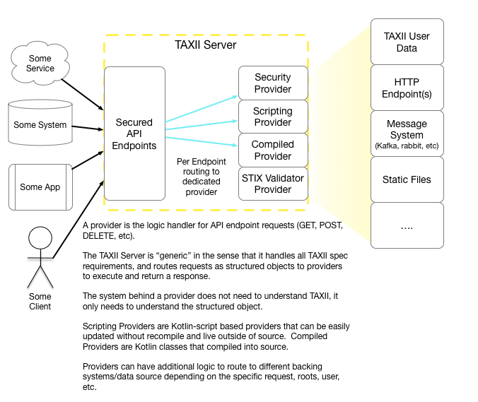
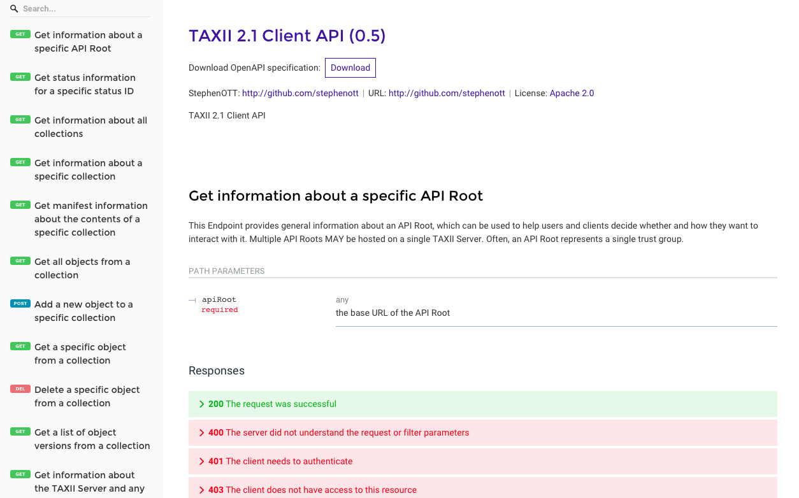
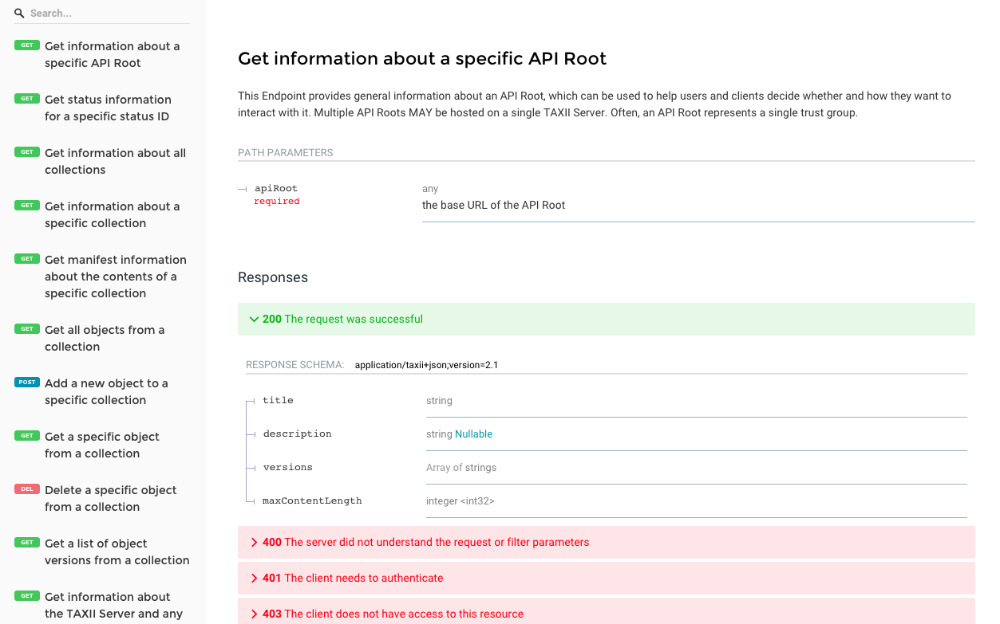
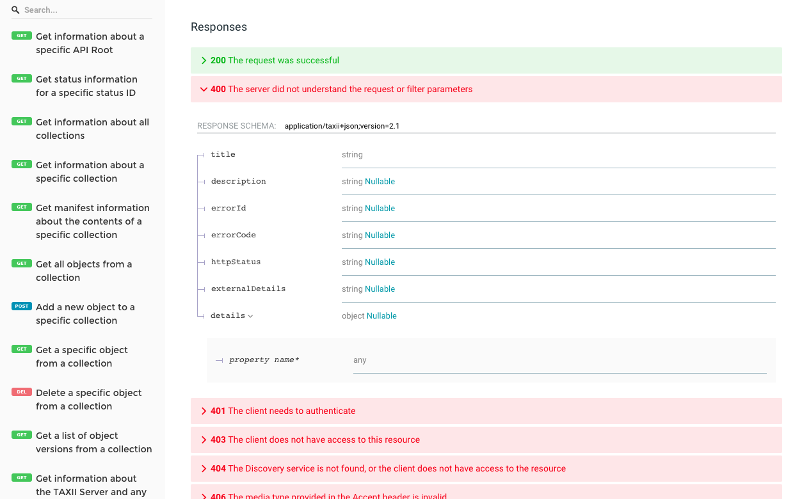
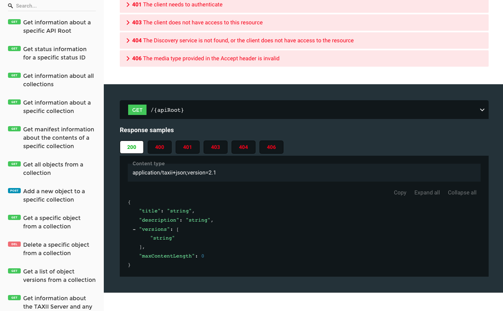
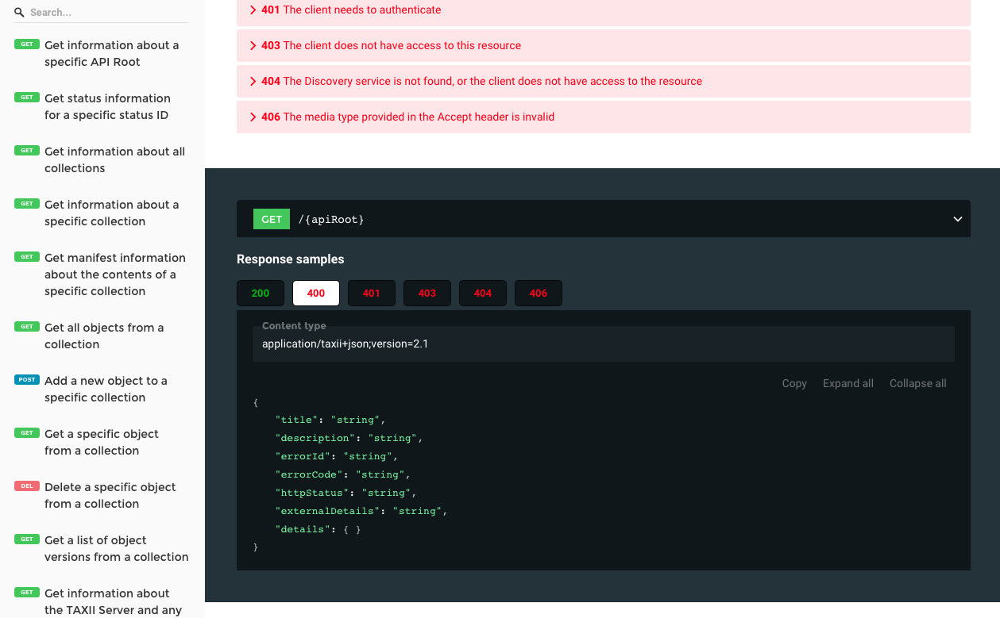

# TAXII Server

A TAXII Server (2.1) designed for maximum flexibility and connectivity options with backend data sources. 
 
The server is designed to route all requests into script or compiled providers that provide connectivity with stix (or non-stix) data-sources (kafka, rabbit, static files, proxy for internal http urls, etc).

Using providers, you can consume STIX directly from a STIX data source, or use the providers to stream Cyber Threat Intel (CTI) from various data source and generate the STIX on-demand.

The server targets a full OpenAPI/Swagger Client API file that can be used as documentation of the TAXII API as well as instructions for Client APIs to consume from.

# Start the Server

Download the jar from [releases](https://github.com/StephenOTT/TAXII-Server/releases)

Then run: `java -jar taxii-server-micronaut-0.5-all.jar`

## Default Basic Auth

**Username**: `sherlock`

**Password**: `password`

# Docker

1. Go to project
1. Run `docker build -t taxii-server .`
3. Run `docker run -p 8080:8080 --name taxii taxii-server`

# Defaults

## Headers

1. `Content-Type`: if not provided, will default to `application/taxii+json;version=2.1`
1. `Accept`: if not provided, will default to `application/taxii+json;version=2.1`

# OpenAPI / Swagger file

Start the server and go to: `http://localhost:8080/swagger/taxii-client-api-0.5.yml`

## Redoc: Swagger Viewer

The server provides a [ReDoc](https://github.com/Redocly/redoc) view for the OpenAPI/Swagger file

You can access the viewer by starting the server and go to: `http://localhost:8080/redoc/index.html`

The ReDoc viewer will load any theme and js dependencies CDNs.

### ReDoc Viewer Screenshots

